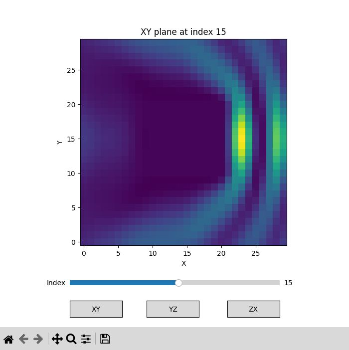

Under construction
### abstract
This program reads the out.ofd file generated by OpenFDTD(https://ss023804.stars.ne.jp/OpenFDTD/index.html), calculates the electric field strength from the complex electric field vector, and displays it.



### environment construction
```code
$ uv venv  
$ source .venv/bin/activate  
$ uv pip install -r requirements.txt  
```
### Description of each file
main code  
maindisp.py:    Read the data file and display the data. Read only ofd.out.  
  
sub code  


